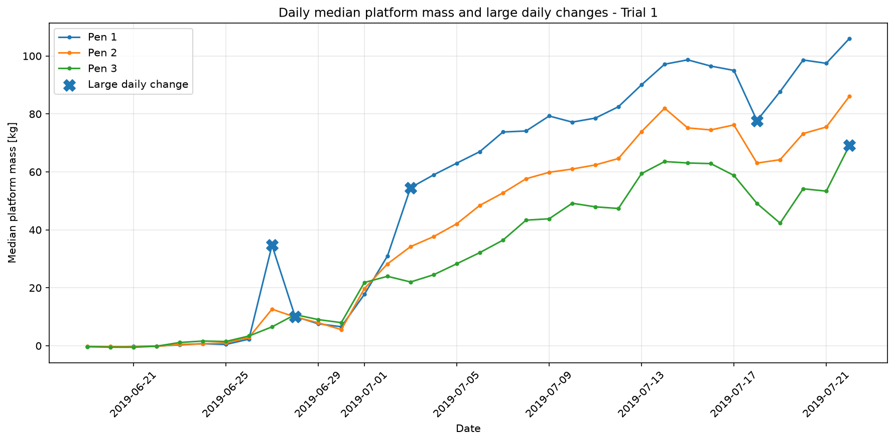
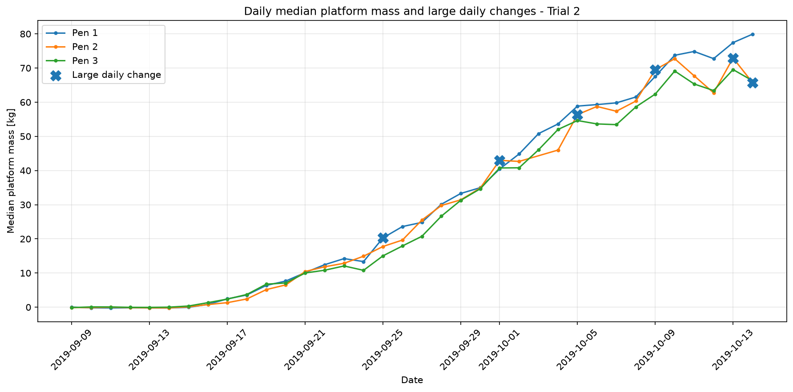
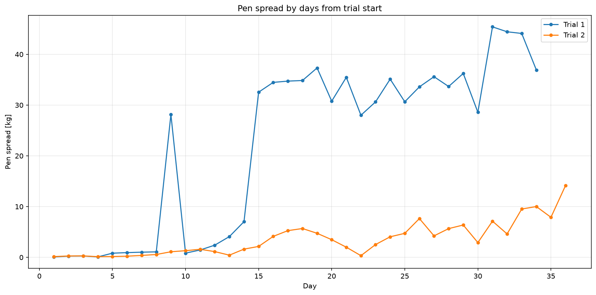

# Broiler Monitoring Analysis

## 1. 背景・目的

ブロイラーの飼育では、成長状況や鶏群の状態を継続的に把握することが重要である。

本分析では、鶏舎内に設置された計量プラットフォームから取得されたデータを使用し、
飼育期間中のプラットフォーム荷重の推移を分析する。

日々の変化やPen間の違いを数値化することで、
通常とは異なる推移を示す日や期間を自動的に絞り込み、
モニタリングに活用できる指標を検討することを目的とする。


## 2. 使用データ

2つのTrialについて、日単位で記録された計量データを使用した。

- Trial 1：2019-06-19 ～ 2019-07-22（34日）
- Trial 2：2019-09-09 ～ 2019-10-14（36日）
- Pen：1 ～ 3

主な項目：

- `datetime`：測定日時
- `pen`：Pen番号
- `mass[kg]`：プラットフォームで記録された荷重

生データはファイルサイズが大きいため、
日付・Pen単位で集計したデータを作成して分析に使用した。


## 3. 分析の流れ

1. 生データの構造・欠損・測定期間を確認
2. 日付・Pen単位で荷重の中央値などを集計
3. Penごとの成長傾向を可視化
4. 前日からの変化量を算出
5. 通常より大きな変化がみられる日を抽出
6. 同一Trial内のPen間差を算出
7. 一時的な変化と継続的な変化を比較


## 4. 成長傾向

Trial 1・Trial 2ともに、
飼育期間の経過に伴ってプラットフォーム荷重の中央値が上昇する傾向が確認された。

一方で、Trial 1ではPenごとの差や日々の変動が比較的大きく、
Trial 2では3つのPenが比較的近い値で推移した。

### Trial 1



### Trial 2




## 5. 前日変化による確認候補の抽出

各Penの日次中央値について、前日との差を算出した。

Trialごとに日々の変動幅が異なっていたため、
全Trialで同じ固定値を使用するのではなく、
各Trialの前日変化量の絶対値について95%点を探索的なしきい値として使用した。

- Trial 1：14.291 kg
- Trial 2：6.910 kg

この基準以上の変化を「確認候補」として抽出した結果、

- Trial 1：5日
- Trial 2：6日

が確認候補となった。

このしきい値は異常を確定するものではなく、
詳細確認が必要なデータを絞り込むための探索的な基準として使用している。


## 6. Pen間差の分析

同一日におけるPen別中央値について、

**最大値 - 最小値**

をPen間差として算出した。

### Trial 1

- 平均：22.10 kg
- 中央値：30.64 kg
- 最大：45.41 kg

### Trial 2

- 平均：3.57 kg
- 中央値：2.72 kg
- 最大：14.17 kg

Trial 1ではTrial 2と比較してPen間差が大きく、
期間後半では30 kg以上の差が継続して確認された。

一方、Trial 2では3つのPenが比較的近い推移を示した。




## 7. 一時的な変化と継続的な変化

Trial 1では、Pen間差が急激に拡大するケースが確認された。

Day 9ではPen間差が

**1.08 kg → 28.15 kg**

まで拡大したが、翌日には

**0.83 kg**

まで縮小しており、一時的な変化だった。

一方、Day 15では

**7.03 kg → 32.54 kg**

へ急拡大した後も、複数日にわたって30 kg以上のPen間差が継続した。

このことから、単日の変化量だけでなく、
変化後の状態が継続しているかを確認することで、
一時的な変動と継続的な状態変化を区別できる可能性がある。


## 8. モニタリングへの活用

今回の分析から、以下の指標を組み合わせることで、
通常とは異なる推移を示す日や期間を絞り込める可能性が示された。

- Penごとの前日変化量
- Pen間の乖離
- 乖離状態の継続

これらを利用することで、
大量のセンサーデータをすべて目視するのではなく、
詳細確認が必要な日を自動的に抽出する仕組みへの応用が考えられる。


## 9. 注意点・今後の課題

- 95%点は探索的に設定したしきい値であり、異常を確定する基準ではない
- 荷重変化の原因については、本データのみでは特定できない
- 飼育管理情報やセンサー状態など、他の情報との照合が必要
- Trial 2では2019-10-03のPen 2データが存在しない
- 今後はモニタリング指標の妥当性や、継続的な変化を判定する方法を検討する


## 10. 使用技術

- Python
- pandas
- NumPy
- Matplotlib
- Jupyter Notebook
- Git / GitHub


## 11. ディレクトリ構成

```text
broiler-monitoring-analysis/
├── data/
│   ├── raw/
│   ├── interim/
│   └── processed/
├── images/
├── notebooks/
│   ├── 01_data_overview.ipynb
│   └── 02_growth_anomaly_analysis.ipynb
├── sql/
├── src/
├── .gitignore
├── README.md
└── requirements.txt
```

※ 生データおよび中間データはGitHubには含めていない。